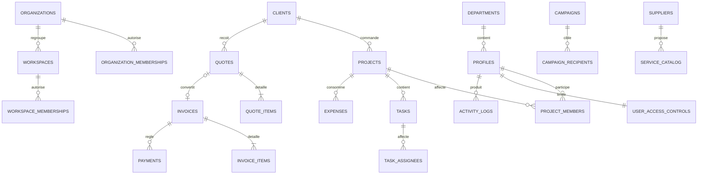

# Diagramme existant et dictionnaire synthétique

| Domaine | Tables principales | Champs structurants | Décision cible |
|---|---|---|---|
| Identité | profiles, departments | id, role(s), department_id, tenant_owner_id, active | Étendre, ne pas confondre compte et membre |
| Organisation | organizations, workspaces, memberships | organization_id, workspace_id, role | Adapter après réception de Smart Cell |
| Projets | projects, project_members | client_id, manager_id, dates, budget, status | Conserver et généraliser |
| Tâches | tasks, task_assignees, comments | project_id, assignee_id, status, priority, due_at | Conserver et étendre dépendances/preuves |
| Finance | quotes, invoices, items, payments, expenses | number, client/project, currency, total, status | Adapter en séparant factures reçues/émises/reçus |
| Achats | purchase_requests, suppliers, service_catalog | demandeur, coût, statut, catégorie | Étendre vers consultation, offre, notation, attribution |
| Communication | campaigns, recipients, logs | channel, consent, statut, résultat | Adapter pour campagnes ONG |
| Documents | documents, verifications | lien, catégorie, jeton, audit | Étendre classification/rétention |
| Sécurité | access_controls, activity_logs, sessions | modules, refus, plafonds, metadata | Étendre vers RBAC + ABAC + accès exceptionnel |

Le dictionnaire complet définitif ne peut être produit pour Smart Cell Management sans son schéma source. Les interfaces d’adaptation attendent : `ExternalCell`, `ExternalCellMembership`, `ExternalCellRole`, `ExternalCellScope` et `ExternalCellRelationship`.
